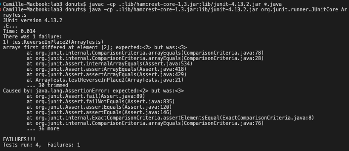

# CSE 15L Lab 3
## Camille Saldajeno
___

### Part A

***Failure inducing input***
```
@Test 
public void testReverseInPlace2() {
  int[] input1 = {1,2,3,4 };
  ArrayExamples.reverseInPlace(input1);
  assertArrayEquals(new int[]{4,3,2,1}, input1);
	}
```
***input that doesn't induce a failure***
```
@Test 
public void testReverseInPlace3() {
  int[] input1 = {0};
  ArrayExamples.reverseInPlace(input1);
  assertArrayEquals(new int[]{0}, input1);
}
```
***Symptom***

***Bug Before***

```
// Changes the input array to be in reversed order
static void reverseInPlace(int[] arr) {
  for(int i = 0; i < arr.length; i += 1) {
    arr[i] = arr[arr.length - i - 1];
  }
}
```
***Bug After***
```
// Changes the input array to be in reversed order
static void reverseInPlace(int[] arr) {
  for(int i = 0; i < arr.length/2; i += 1) {
    int temp = arr[i]; 
    arr[i] = arr[arr.length - i - 1];
    arr[arr.length -i-1] = temp; 
  }
}return newArray; 
}
```
***Describe why the fix addresses the issue***
The orignal code was attempting to reverse the array in place, but didn't have a way to preserve the intial values. This resulted in the code overwriting each element with its corresponding element from the opposite end of the array. With this updated code, we reverse the input array in place by swapping elements, preserving the original values during the reversal process.

___
### Part B

